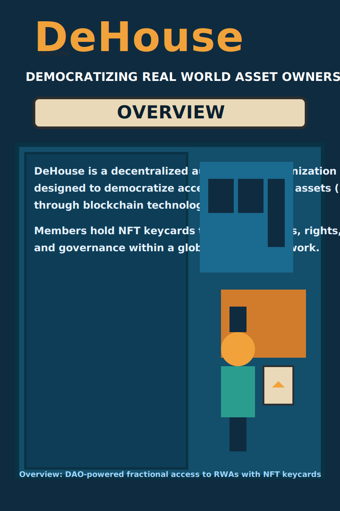
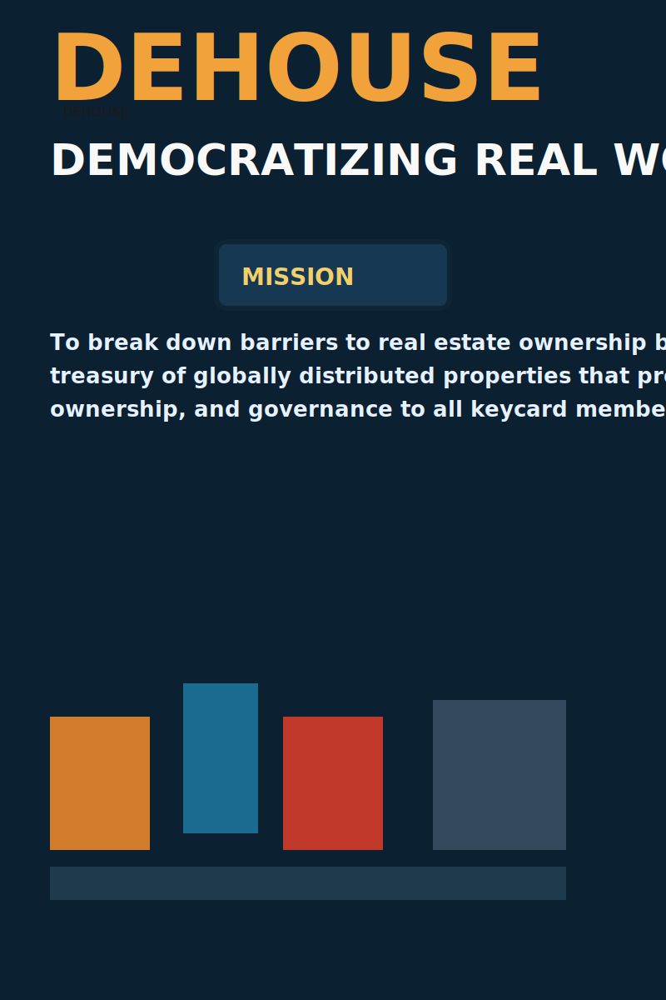
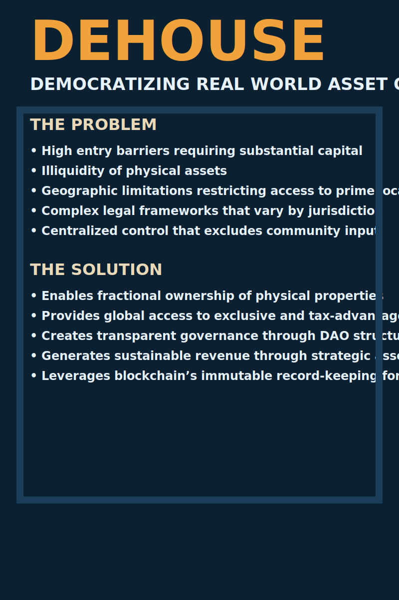

# Project Overview

A visual overview of De House’s mission and model. Each poster is optimized as lightweight, scalable SVGs for crisp rendering on any screen size.

> Tip: Click images to open in a new tab for full-size viewing.

---

## 1) Overview Poster

<figure>
  
  <figcaption style="margin-top:8px;color:#6b7280">DeHouse is a decentralized autonomous organization enabling fractional access to real-world assets via NFT keycards.</figcaption>
</figure>

---

## 2) Mission Poster

<figure>
  
  <figcaption style="margin-top:8px;color:#6b7280">Mission: build a self-sustaining treasury of globally distributed properties that provide shared access, ownership, and governance.</figcaption>
</figure>

---

## 3) Problem & Solution Poster

<figure>
  
  <figcaption style="margin-top:8px;color:#6b7280">From high barriers and illiquidity to transparent, fractional ownership and governance using blockchain.</figcaption>
</figure>

---

### Notes on Optimization
- SVGs are vector-based for maximum clarity and small file size.
- Each image includes descriptive alt text for accessibility and SEO.
- Captions summarize the most important takeaway for quick scanning.